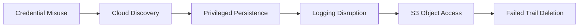

# CloudTrace — AWS Incident Detection and Response Lab


A hands-on cloud incident-response project that transforms synthetic AWS CloudTrail events into a validated incident timeline, security findings, indicators, MITRE ATT&CK mappings, Sigma detections and executive reporting.

> **Security notice:** This project uses synthetic identities, AWS resources, events and indicators created exclusively for authorized security training. It contains no production credentials, customer data or confidential incident evidence.

## Executive Summary

CloudTrace investigates suspected misuse of an AWS IAM automation identity.

The simulated activity begins with cloud-resource discovery and progresses through:

1. IAM and S3 enumeration
2. Unauthorized IAM user creation
3. Persistent access-key creation
4. Administrative privilege assignment
5. CloudTrail logging disruption
6. Sensitive S3 object access
7. Attempted deletion of audit infrastructure

The project distinguishes confirmed evidence from analytical inference. Administrative changes and object access are represented in the dataset, while the original credential-acquisition method and external data exfiltration remain unconfirmed.

## Project Results

| Metric | Result |
|---|---:|
| CloudTrail events analyzed | 12 |
| Detection findings generated | 11 |
| Critical findings | 6 |
| High findings | 2 |
| Medium findings | 3 |
| Sigma detection rules | 3 |
| Automated tests | 20 passing |
| Source IP indicators | 1 |
| Incident duration | 16 minutes 43 seconds |
| Generated reports | Executive and technical |

## Interactive Incident Dashboard

The live dashboard presents incident severity, attack progression, MITRE ATT&CK coverage, Sigma detections, indicators and a searchable security-finding register.

[Open CloudTrace AWS Incident Response Dashboard](https://amrabd-elaziz.github.io/cloudtrace-incident-response/)

The dashboard data is generated automatically from the processed CloudTrail evidence and validated through GitHub Actions before deployment.

## Incident Overview

| Attribute | Value |
|---|---|
| Incident classification | Critical |
| Affected identity | `backup-automation` |
| Unauthorized identity | `system-support-backup` |
| Source IP | `198.51.100.24` |
| Target bucket | `financial-transaction-archive` |
| Successful API operations | 11 |
| Failed API operations | 1 |
| Evidence source | Synthetic AWS CloudTrail |

## Attack Sequence



## Incident Timeline

| Stage | CloudTrail Events | Security Interpretation |
|---|---|---|
| Identity validation | `GetCallerIdentity` | Active IAM identity confirmed |
| Discovery | `ListUsers`, `ListBuckets`, `GetAccountAuthorizationDetails` | IAM, storage and permission enumeration |
| Persistence | `CreateUser`, `CreateAccessKey` | Secondary identity and credentials created |
| Privilege escalation | `AttachUserPolicy` | `AdministratorAccess` assigned |
| Defense evasion | `StopLogging`, `DeleteTrail` | Logging stopped; trail deletion attempted |
| Collection | `GetBucketEncryption`, `ListObjects`, `GetObject` | Storage inspected and object accessed |

## MITRE ATT&CK Coverage

| Tactic | Technique | Evidence |
|---|---|---|
| Discovery | T1087.004 — Cloud Account | IAM user and authorization enumeration |
| Discovery | T1619 — Cloud Storage Object Discovery | S3 bucket and object enumeration |
| Persistence | T1136.003 — Cloud Account | Unauthorized IAM user creation |
| Persistence | T1098.001 — Additional Cloud Credentials | Access-key creation |
| Privilege Escalation | T1098 — Account Manipulation | Administrative policy attachment |
| Defense Evasion | T1562.008 — Disable Cloud Logs | CloudTrail logging disruption |
| Collection | T1530 — Data from Cloud Storage | S3 object access |

## Automated Analysis

The Python analysis engine:

- Validates required CloudTrail fields
- Sorts events chronologically
- Extracts actors, resources and source IPs
- Identifies successful and failed API operations
- Applies event-based detection logic
- Assigns severity and MITRE ATT&CK context
- Produces a CSV incident timeline
- Produces JSON findings and indicators
- Handles nullable CloudTrail fields safely

### Generated Evidence

| Artifact | Purpose |
|---|---|
| `data/processed/incident-timeline.csv` | Chronological incident evidence |
| `data/processed/detection-findings.json` | Structured security findings |
| `data/processed/indicators.json` | Extracted incident indicators |
| `reports/executive/EXECUTIVE-INCIDENT-REPORT.md` | Management-focused assessment |
| `reports/technical/INCIDENT-ANALYSIS-REPORT.md` | Detailed technical investigation |

## Sigma Detection Rules

| Rule | Detection Objective | Severity |
|---|---|---|
| `aws_iam_user_creation.yml` | Detect new IAM user creation | High |
| `aws_administrator_policy_attachment.yml` | Detect `AdministratorAccess` attachment | Critical |
| `aws_cloudtrail_logging_tampering.yml` | Detect CloudTrail stop or deletion activity | Critical |

The project includes a custom validator that:

- Parses each Sigma YAML rule
- Validates required metadata
- Verifies AWS CloudTrail log-source configuration
- Evaluates rule selections against the demonstration dataset
- Fails when a rule does not match its intended evidence

## Investigation Conclusions

Confirmed by the synthetic evidence:

- One IAM identity performed the complete activity chain.
- A new IAM user was created.
- Programmatic credentials were generated.
- Administrative privileges were assigned.
- CloudTrail logging was successfully stopped.
- An S3 object was accessed.
- A later CloudTrail deletion attempt failed.

Not confirmed by the available evidence:

- How the original credentials were acquired
- Whether the S3 object was transferred outside AWS
- Whether activity occurred outside the represented time window

## Root Cause

The primary simulated control failure was excessive authorization assigned to an automation identity.

The identity could administer IAM, interfere with audit logging and access sensitive storage. This violated least privilege and allowed one credential misuse scenario to affect multiple security layers.

Contributing weaknesses included:

- Insufficient separation of duties
- Inadequate protection of CloudTrail
- Missing preventive IAM guardrails
- Use of programmatic credentials
- Delayed behavioral detection

## Recommended Controls

1. Replace long-lived automation credentials with temporary IAM-role sessions.
2. Restrict workload identities using least-privilege policies.
3. Deny IAM administration to non-administrative identities.
4. Protect CloudTrail with organizational Service Control Policies.
5. Centralize logs in a restricted security account.
6. Alert on IAM identity, access-key and policy changes.
7. Correlate discovery, persistence and logging-disruption events.
8. Apply permission boundaries to delegated administration.
9. Review sensitive S3 access using data events.
10. Require evidence-based validation before incident closure.

## Project Structure

```text
cloudtrace-incident-response/
├── .github/
│   └── workflows/
├── dashboard/
├── data/
│   ├── raw/
│   │   └── cloudtrail-events.json
│   └── processed/
│       ├── detection-findings.json
│       ├── incident-timeline.csv
│       └── indicators.json
├── detections/
│   └── sigma/
│       ├── aws_administrator_policy_attachment.yml
│       ├── aws_cloudtrail_logging_tampering.yml
│       └── aws_iam_user_creation.yml
├── docs/
│   ├── INCIDENT-RESPONSE-PLAN.md
│   ├── INVESTIGATION.md
│   └── ROOT-CAUSE-ANALYSIS.md
├── reports/
│   ├── executive/
│   │   └── EXECUTIVE-INCIDENT-REPORT.md
│   └── technical/
│       └── INCIDENT-ANALYSIS-REPORT.md
├── scripts/
│   ├── analyze_incident.py
│   ├── generate_executive_report.py
│   ├── generate_technical_report.py
│   └── validate_detections.py
├── tests/
│   ├── test_analyze_incident.py
│   └── test_sigma_detections.py
├── README.md
└── requirements.txt
```

## Run Locally

### Create the Environment

```bash
python3 -m venv .venv
source .venv/bin/activate
python -m pip install -r requirements.txt
```

### Analyze the Incident

```bash
python scripts/analyze_incident.py
```

### Validate Sigma Detections

```bash
python scripts/validate_detections.py
```

### Generate Reports

```bash
python scripts/generate_executive_report.py \
  --assessment-date 2026-09-09

python scripts/generate_technical_report.py
```

### Run Automated Tests

```bash
python -m unittest discover -s tests -v
```

## Project Documentation

- [Incident Investigation](docs/INVESTIGATION.md)
- [Root Cause Analysis](docs/ROOT-CAUSE-ANALYSIS.md)
- [Incident Response Plan](docs/INCIDENT-RESPONSE-PLAN.md)
- [Executive Incident Report](reports/executive/EXECUTIVE-INCIDENT-REPORT.md)
- [Technical Incident Analysis](reports/technical/INCIDENT-ANALYSIS-REPORT.md)
- [](https://github.com/AmrAbd-Elaziz/ cloudtrace-incident-response/actions/workflows/cloudtrace-validation.yml)
- [](https://amrabd-elaziz.github.io/cloudtrace-incident-response/)

## Security Engineering Decisions

- Raw events are preserved separately from processed evidence.
- Findings are generated from deterministic detection logic.
- Sigma rules are tested against known demonstration events.
- Nullable CloudTrail fields are handled safely.
- Failed API operations remain visible in the incident timeline.
- Object access is not automatically described as confirmed exfiltration.
- Unknown initial access is documented as undetermined.
- Executive and technical reports are generated from the same evidence.

## What This Project Demonstrates

- AWS CloudTrail investigation
- Cloud identity incident analysis
- Incident timeline reconstruction
- MITRE ATT&CK mapping
- Sigma detection engineering
- Indicator extraction
- Evidence preservation
- Root-cause analysis
- Incident-response planning
- Executive and technical reporting
- Python security automation
- Automated validation and testing

## Security Engineering Principle

> Incident response must distinguish evidence from assumption. Effective closure requires containment, verified eradication, restored visibility and controls that reduce recurrence.

## Author

**Amr Abdelaziz**

Cybersecurity Engineer — Security Engineering, Application Security, Vulnerability Management and DevSecOps

- [LinkedIn](https://www.linkedin.com/in/amr-ahmed-abdelaziz94)
- [GitHub](https://github.com/AmrAbd-Elaziz)
- Email: [amahaziz@outlook.com](mailto:amahaziz@outlook.com)